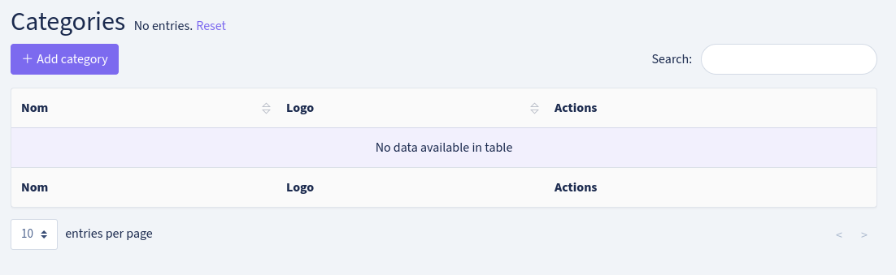
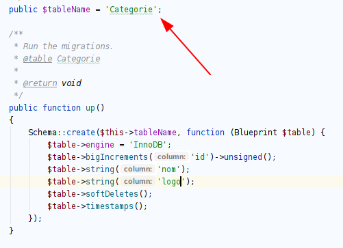
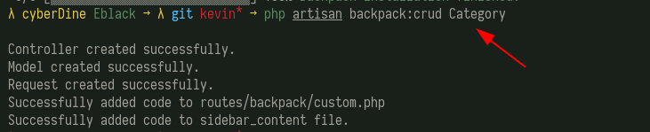
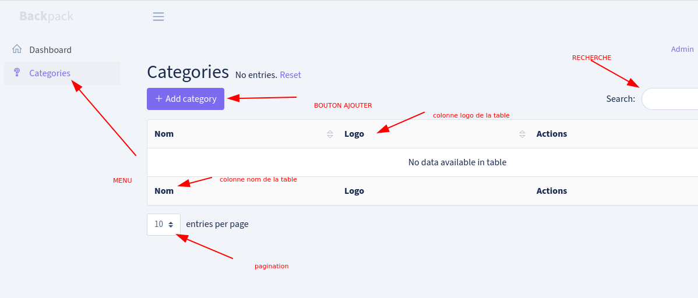
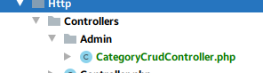

Comme je le disais **backpack** est juste un **package laravel** qui permet de générer des **CRUD** (formulaires pour enregistrer , modifier et un table pour voir la liste des données )

`Toutes les commandes que vous utilisez dans ce cours vous devez vous positionner à la racine du projet` 

**Exemple de CRUD**



Donc après avoir installé les dépéndances de php avec le logiciel composant :

```bash
composer install
```

Lancer la commande suivante pour installer backpack dans votre projet 

```
php artisan backpack:crud Category
```


une fois que c'est fait [ comme l'image précédente ] on considère alors que vous pouvez maintenant créer des CRUD .


**COMMENT GENERER UN CRUD AVEC BACKPACK ?**

**Exemple avec la table categorie de notre base de donnée :**



Le nom de ma table est : Categorie donc je lance la commande suivante :

```bash
php artisan backpack:crud Category
```



ça signifie que votre page est crée et donc vous pouvez y acceder en allant sur :

```
http://127.0.0.1:8000/admin/categorie
```

Ensuite vous verez la page comme suit 



en une seule ligne de commande :

- vous aurez un  fichier Controller 



- un fichier Model

  